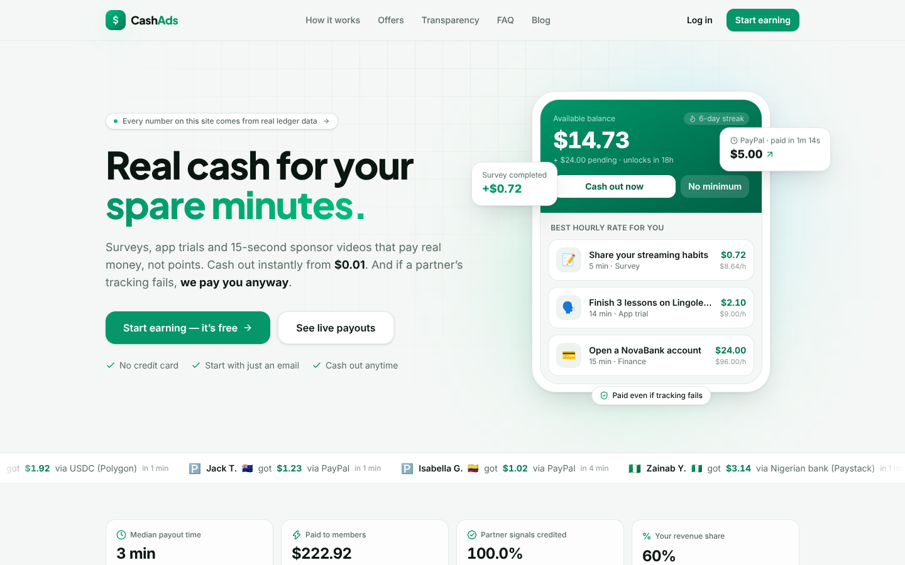
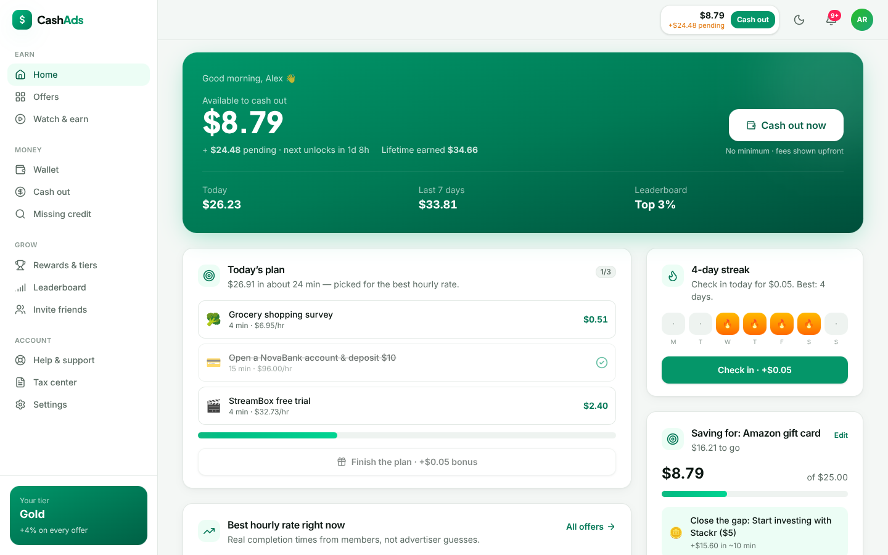
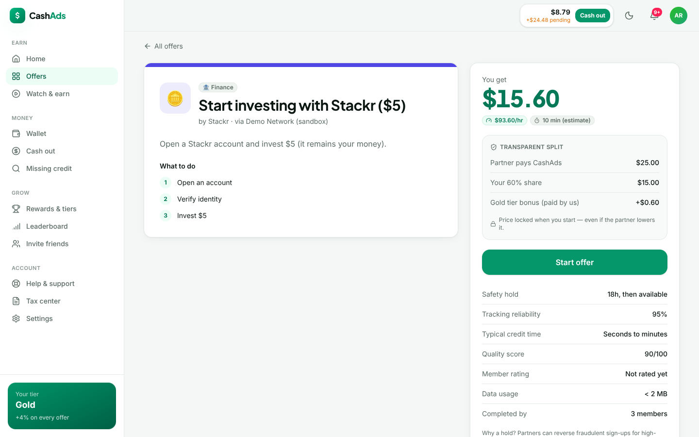
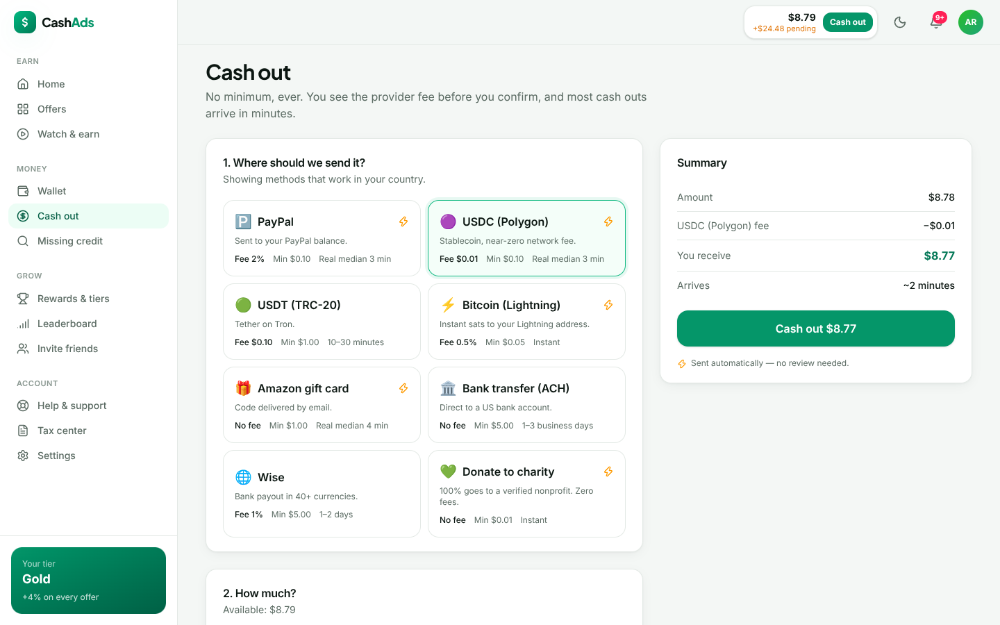
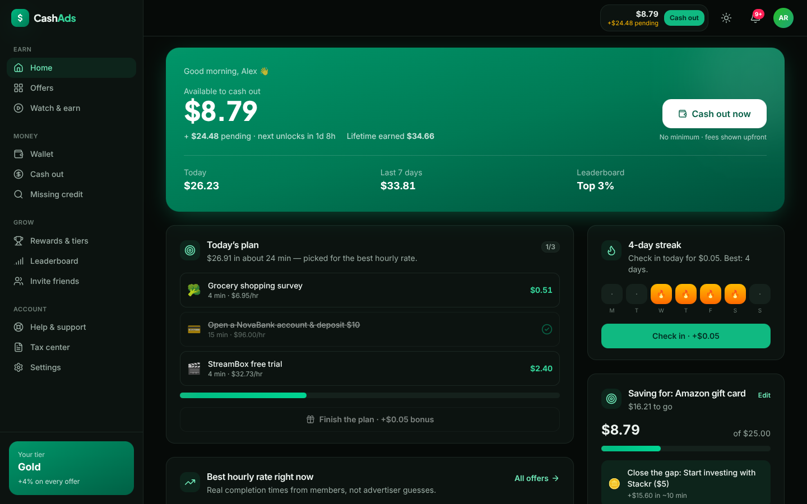
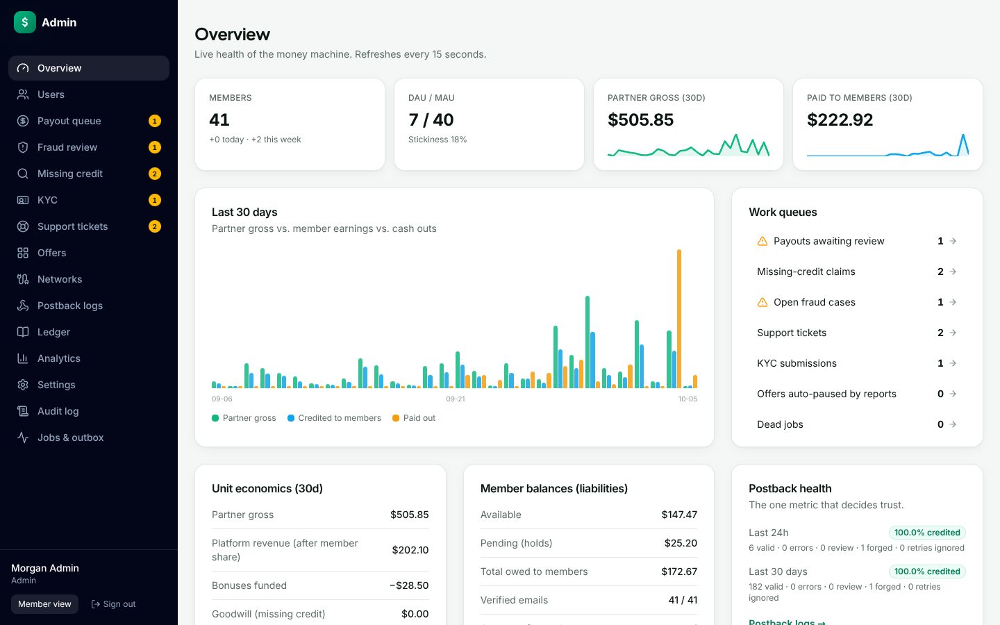
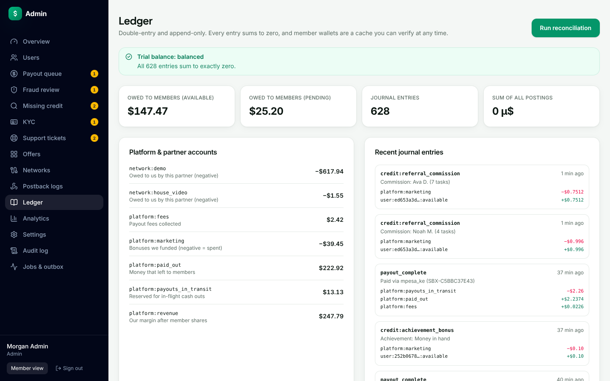

<div align="center">

# 💸 CashAds

**The trust-first rewards wallet.** Real money for surveys, app trials, games and 15-second sponsor videos.<br/>
Instant cash outs · no minimum · no points · and **we pay you even when tracking fails.**

[Product brief](docs/PRODUCT_BRIEF.md) · [Architecture](docs/ARCHITECTURE.md) · [Spec coverage](docs/SPEC_COVERAGE.md) · [API reference](docs/API.md)

</div>



---

## What this is

A complete, production-shaped implementation of the product described in [`docs/PRODUCT_BRIEF.md`](docs/PRODUCT_BRIEF.md): a member app, a public marketing and transparency site, an admin console, and the money engine underneath. The engine covers offers, partner postbacks, rewarded video, a double-entry ledger, payouts, fraud, missing-credit claims, referrals and engagement.

It runs locally with **zero external services**: the API embeds a real PostgreSQL (PGlite/WASM), seeds a realistic demo world, and ships a built-in **sandbox partner network**. The sandbox network fires *real signed HTTP postbacks*, and can deliberately lose them so you can watch missing-credit recovery work. Point `DATABASE_URL` at Postgres and add provider keys, and the same code runs in production.

| Member dashboard | Offer detail: transparent split + price lock |
|---|---|
|  |  |
| **Cash out: no minimum, fees upfront** | **Dark mode** |
|  |  |
| **Admin overview** | **Double-entry ledger, reconciled** |
|  |  |

## Quick start

```bash
npm install
npm run dev          # API on :4000 (internal) + web on :3000
```

Open **http://localhost:3000**. The first start migrates and seeds the embedded database (about 15 s). The login page has one-click demo accounts:

| Account | Email | Password | What you'll see |
|---|---|---|---|
| Member (US, Gold) | `demo@cashads.dev` | `Demo12345!` | 3 weeks of history, a $24 bank reward in a safety hold, a claim in human review, 4-day streak |
| Member (Nigeria) | `ada@cashads.dev` | `Demo12345!` | Local rails (Paystack in ₦), Nigeria-only offers |
| Admin | `admin@cashads.dev` | `Admin12345!` | Work queues with real items: payout review, fraud ring, claims, KYC, tickets |
| Support agent | `support@cashads.dev` | `Support12345!` | Staff view without admin-only powers |

Emails and SMS codes land in the **dev mailbox** at `/dev/mailbox` in demo mode, so you can verify emails and phones end to end.

### A 5-minute tour

1. **Earn**: Offers → *Grocery shopping survey* → Start → answer on the partner site → Return. A signed postback arrives about 3 s later and the reward animation plays live over SSE.
2. **Missing credit**: open *Travel plans 2026* (its partner "loses" postbacks), complete it, return, and tap **Finished but not credited?** CashAds queries the partner's conversion API and auto-approves within seconds.
3. **Video**: Watch & earn. The server verifies the full event chain and real wall-clock timing. Switch tabs and the video pauses. Watch several in a row for a combo bonus.
4. **Cash out**: pick a rail, see the exact fee and local-currency amount, confirm, and track the status timeline (usually under 2 s in the sandbox). Use a destination containing `fail` to see a refund, or `slow` for async settlement.
5. **Admin** (`admin@cashads.dev`): approve the payout in review, clear or ban the multi-account ring, replay postbacks, simulate a partner chargeback, then **Run reconciliation** on the ledger.

## Features

**For members**
- Real currency everywhere, kept exact in integer micro-dollars, with sub-cent amounts never rounded away.
- Hourly rate on every offer, using real member completion times once enough data exists; sort and filter by $/hr, time and data usage.
- A **transparent split** on every offer (what the partner pays us next to your share) and a **price lock** when you start.
- **No-minimum instant cash outs**: PayPal, USDC/USDT, Lightning, Amazon, ACH, Paystack (₦), M-Pesa, MTN MoMo, GCash, UPI, Pix, Wise, charity. Only methods that work in your country are shown, with locked FX.
- **Missing-credit claims**: automatic replay of failed postbacks, partner conversion lookup, a Gold+ instant fast lane, then human review with a published SLA. A watchdog also nudges members whose credit never arrived.
- **Rewarded video**: server-verified playback (sequence plus quartile spacing), pause on tab switch, one earning device at a time with one-tap takeover, combo bonus up to +25%, failed loads don't count.
- Safety holds explained item by item with exact unlock times; tiers shorten them, and Platinum has none.
- Engagement: daily streak ladder, personalised 3-task daily plan, savings goal with goal-gradient nudges, achievements with real bonuses, tiers (Bronze → Platinum), rolling leaderboards.
- Referrals: link, QR and native share; both sides get a bonus after the friend's first offer; 10% commission for 12 months, platform-funded and settled in batches; self-referral detection.
- Account: TOTP 2FA, sessions and devices with remote sign-out, login history, phone verification, KYC uploads, GDPR export and deletion, account health with clear reasons and one-tap appeal, tax center with CSV export.
- PWA (installable, offline fallback), dark mode, **data-saver mode** for 3G, fully responsive with a mobile bottom nav.

**For staff**
- Overview: unit economics, liabilities, postback health (the one metric that decides trust), 30-day charts and work queues.
- Payout review with bulk approve, fraud cases with explainable signals and linked accounts, claims with postback evidence, KYC, and support tickets with SLA timers and macros.
- Offer management (quality score, reliability, auto-pause on reports), partner networks (postback URLs, secret rotation), postback logs with safe replay and simulated chargebacks.
- Ledger trial balance, wallet reconciliation and journal browser; analytics (funnel, retention cohorts, ARPU, time to first payout); runtime-editable business rules; immutable audit log; job queue and outbox.

**Platform**
- Double-entry, append-only, idempotent ledger with a wallet cache verified by reconciliation.
- Postback pipeline: five signature schemes, constant-time compare, forged requests can't squat transaction ids, idempotency, conversion windows, price lock, holds, reversals with loss absorption, goodwill recovery.
- Transactional outbox and a Postgres job queue (`FOR UPDATE SKIP LOCKED`) with exponential backoff and dead-lettering; safe on many instances, no Redis needed.
- Security: scrypt passwords, opaque DB sessions (httpOnly cookies, CHIPS-partitioned over HTTPS), CSRF header check, rate limits, AES-256-GCM secrets at rest, CSP and security headers, audit logs.

## Architecture at a glance

```
Browser ──► Next.js 16 (web, :3000) ──/api/* rewrite──► Fastify API (:4000, internal)
               SSR marketing pages                         ├─ REST + SSE (live balance, credits, payout feed)
               React 19 client app                         ├─ Postback / SSV receivers (server-to-server)
               Admin console                               ├─ Worker: holds, payouts, claims, emails, stats
                                                           └─ PostgreSQL (PGlite in dev · Postgres in prod)
Partner networks ──signed postbacks──► /api/postback/:network
```

Details, including the money model, state machines, fraud scoring and scaling notes, are in **[docs/ARCHITECTURE.md](docs/ARCHITECTURE.md)**.

| Layer | Choice |
|---|---|
| Web | Next.js 16 (App Router, Turbopack), React 19, Tailwind CSS 4, TanStack Query 5, Zustand, lucide icons, self-hosted fonts |
| API | Fastify 5, Drizzle ORM, zod 4 (validation shared with the web), Server-Sent Events |
| Data | PostgreSQL 17/18 (embedded PGlite for dev/test, `pg` pool in production), SQL migrations via drizzle-kit |
| Tests | Vitest integration suite (40 tests) against a real in-memory Postgres and real HTTP |
| Ops | Dockerfile (api + web targets), docker-compose with Postgres, GitHub Actions CI |

## Project structure

```
apps/
  api/                 Fastify API + worker
    src/modules/       auth · account · offers · postbacks · video · rewards · wallet (ledger)
                       payouts · claims · fraud · referrals · engagement · notifications
                       support · public · admin · sandbox · settings
    src/jobs/          Postgres job queue, handlers, scheduler
    src/db/            schema, client (PGlite | pg), catalog, seed
    drizzle/           SQL migrations
    test/              integration tests
  web/                 Next.js app
    app/(marketing)    landing, how it works, offers, transparency, FAQ, blog, legal, status
    app/(auth)         login (2FA), signup, reset, verify
    app/app            member app        app/admin   staff console
    app/partner        sandbox partner site          app/dev     demo mailbox
packages/
  shared/              money math, domain constants, zod schemas, DTO types, FAQ
docs/                  product brief, architecture, spec coverage, API reference
```

## Scripts

| Command | What it does |
|---|---|
| `npm run dev` | API (watch mode) + web dev server |
| `npm test` | API integration tests |
| `npm run typecheck` | TypeScript across all workspaces |
| `npm run build` / `npm start` | Production builds / servers |
| `npm run db:generate` | Generate a SQL migration from schema changes |
| `npm run db:migrate` / `db:seed` / `db:reset` | Migrate, seed demo data, wipe the embedded DB |

## Configuration

Everything is optional in development. See **[`.env.example`](.env.example)** for every variable. The important ones:

- `DATABASE_URL`: Postgres connection string. Empty means embedded PGlite under `DATA_DIR`.
- `APP_SECRET`: 32+ chars, **required in production**. Encrypts payout destinations, TOTP secrets and partner secrets.
- `DEMO_MODE` / `SEED_ON_START`: demo helpers and seed data. Default on outside production.
- `RESEND_API_KEY`, `PAYPAL_*`, `PAYSTACK_SECRET_KEY`, `GOOGLE_*`: real providers. Without them, sandbox implementations are used.

Run the production-like stack with real Postgres:

```bash
APP_SECRET=$(openssl rand -hex 32) docker compose up --build
```

## Going live checklist

The code is production-shaped. These are the business steps the brief describes that code can't do for you:

1. **Partners**: apply to offerwalls (CPX, BitLabs, AdGate, Lootably…). Configure each network's parameter map and signature scheme in `apps/api/src/db/catalog.ts` (presets included; verify against each partner's docs) and give them the postback URL shown in **Admin → Networks**.
2. **Payout rails**: add PayPal Payouts and Paystack keys (adapters included; validate in their sandboxes), then add providers for the other rails behind the same `PayoutProvider` interface.
3. **KYC**: swap the sandbox auto-review for Persona, Onfido or Smile ID webhooks (`modules/account/service.ts → decideKyc`).
4. **Email/SMS**: set `RESEND_API_KEY`; add an SMS provider in `notifications/service.ts → deliverMessage`.
5. **Scale-out**: replace the in-process `EventBus` with Redis pub/sub or Postgres `LISTEN/NOTIFY` (same interface), and run more API instances (the job queue is already multi-instance safe).
6. **Legal**: the Terms, Privacy and Cookie pages are plain-language templates. Have counsel review them per jurisdiction (KYC/AML, 1099 reporting, GDPR, NDPR).
7. Set `FRAME_ANCESTORS='self'`, `DEMO_MODE=false`, `SEED_ON_START=false`, and add monitoring (Sentry/Datadog) on top of the structured pino logs.

## Testing

```bash
npm test
```

The suite boots the real app against an in-memory Postgres with a listening HTTP server, so sandbox postbacks are real HTTP calls. It covers ledger invariants (balanced, idempotent, deadlock guard), auth (lockout, verification, reset, TOTP with replay protection, CSRF), the postback pipeline (signatures, duplicates, price lock, holds, milestones, reversals, loss absorption), payouts (requirements, idempotency, no minimum, refunds, review, KYC), video verification, missing-credit claims (auto-approval and goodwill recovery), streaks, referrals, achievements and fraud review. Every test ends with a trial-balance and reconciliation check.
