# CashAds — the trust-first rewards wallet

> **Real cash for your spare minutes. No points. No minimum. Paid even when tracking fails.**

CashAds pays people real money for short tasks — surveys, app trials, sign-ups, quick polls, micro-lessons and
rewarded videos — and lets them cash out **from $0.01** on rails that actually work where they live (bank transfer
and airtime in Nigeria, MoMo in Ghana, M-Pesa in Kenya, UPI, GCash, Pix, PayPal, Lightning, USDT…).

It is built from the product research in [`docs/product-spec.md`](docs/product-spec.md): rewards apps fail on
**trust**, not technology — credits that never arrive, minimums you never reach, points that hide low pay, payouts
that take weeks and bans without reasons. CashAds is engineered the other way round.

|                                                                               |                                                                           |
| ----------------------------------------------------------------------------- | ------------------------------------------------------------------------- |
| 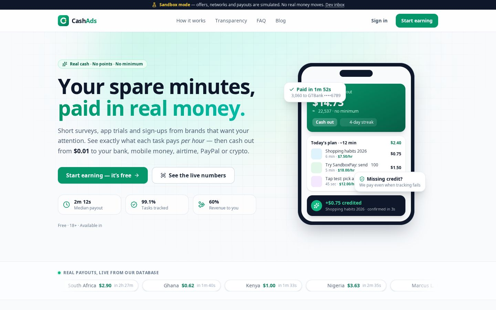                                   | 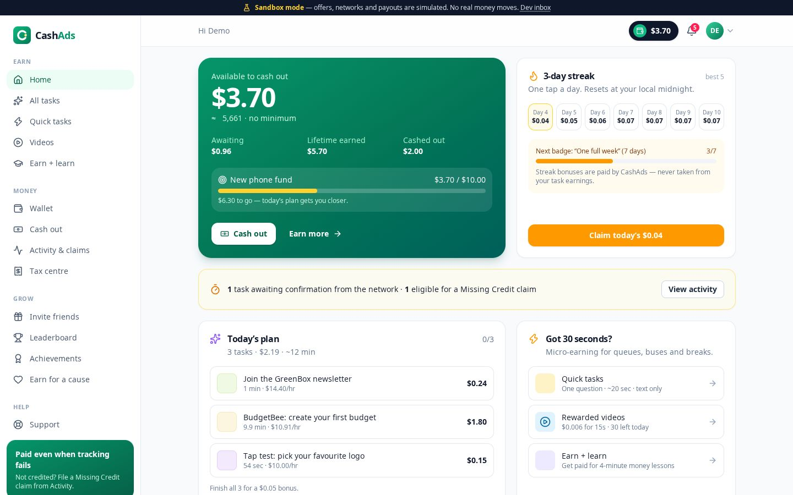                           |
| 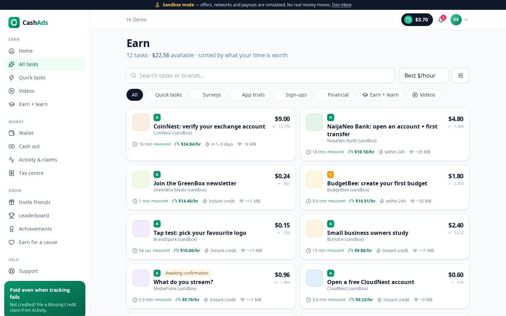             | 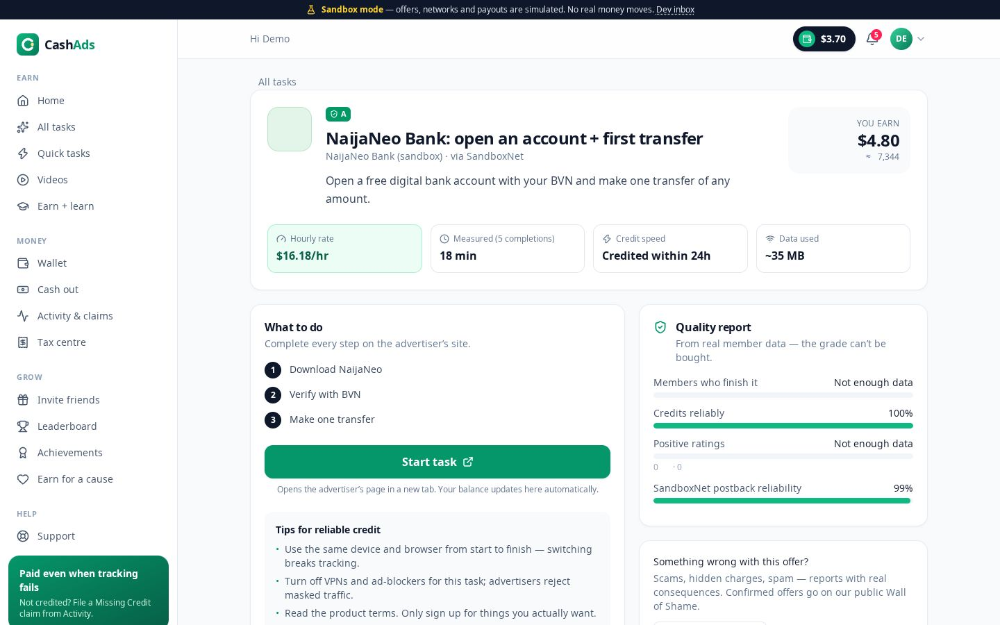 |
| 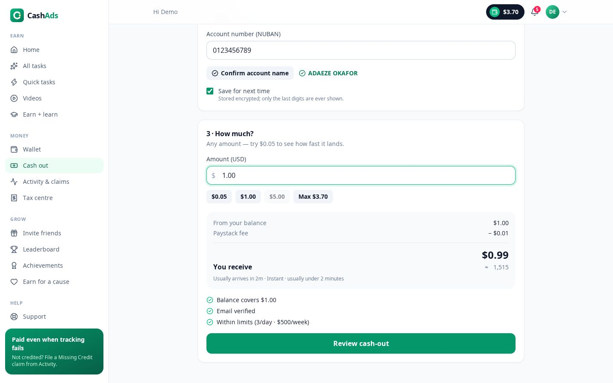 | 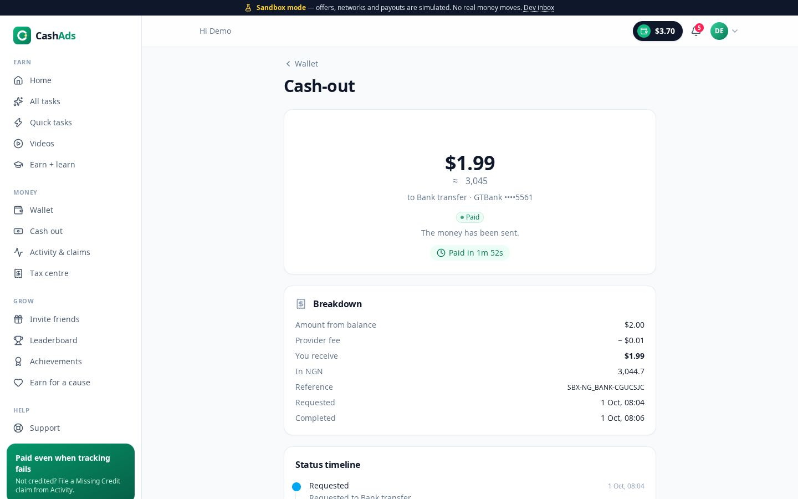        |
| 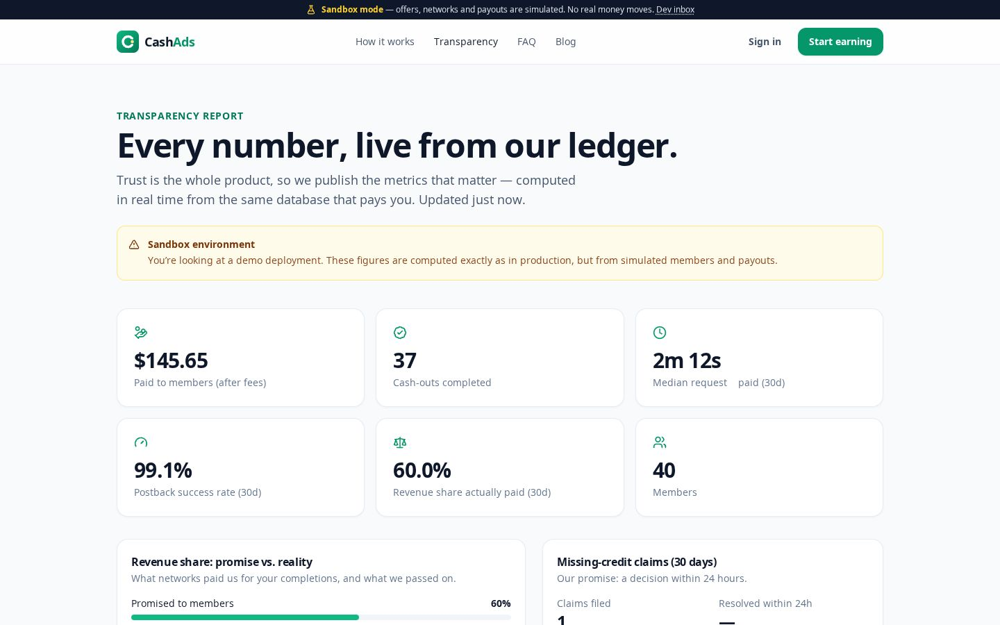                  | 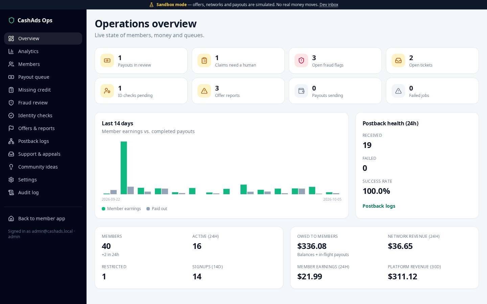      |

<p align="center">
  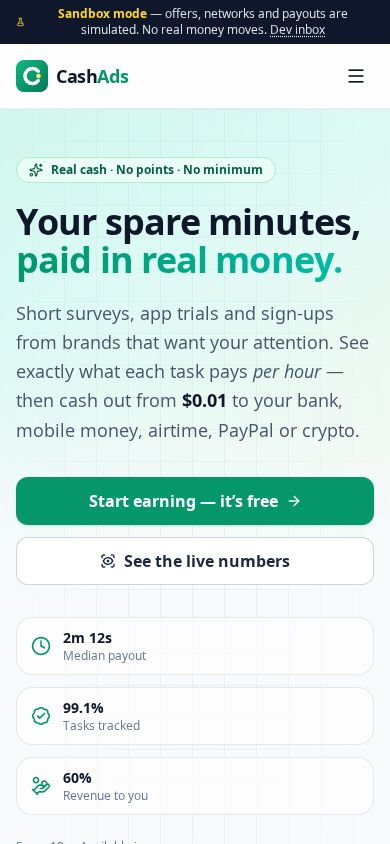
  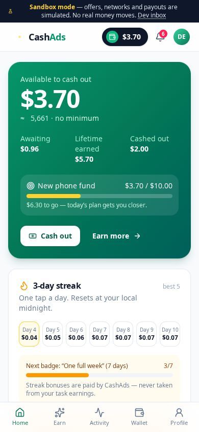
  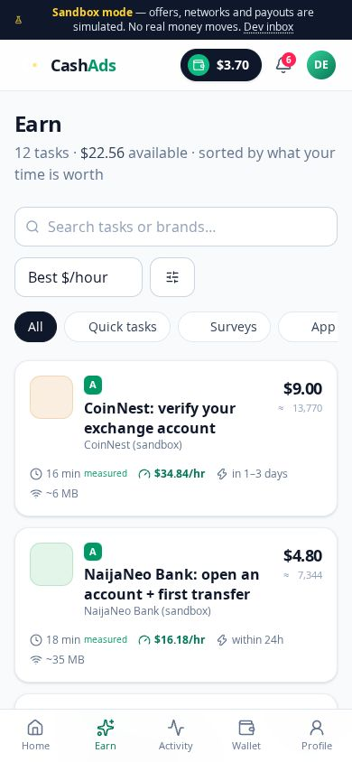
</p>

---

## The five promises (and how the code keeps them)

| Promise                           | How it's enforced                                                                                                                                                                                                                                                   |
| --------------------------------- | ------------------------------------------------------------------------------------------------------------------------------------------------------------------------------------------------------------------------------------------------------------------- |
| **Real money, not points**        | Every amount is integer micro-dollars in a double-entry ledger, displayed as USD **and** local currency (₦, KSh, ₹…). There is no points table anywhere.                                                                                                            |
| **No minimum cash-out**           | Payout validation only applies _provider_ floors (e.g. a $1 gift card) and shows the fee before you confirm. `$0.05` to airtime or Lightning works.                                                                                                                 |
| **Paid even when tracking fails** | Missing Credit claims walk an automatic ladder: postback logs → network conversion API → instant goodwill for trusted tiers → human review with a 24h SLA → **auto-approve if we miss the SLA**. Late network payments _recover_ goodwill instead of double-paying. |
| **The real hourly rate**          | `payout ÷ duration` on every offer, using the **measured median** of real completions once there are ≥5 samples (labelled), plus an A–F quality grade from completion rate, credit reliability, ratings and reports.                                                |
| **Public proof**                  | `/transparency` computes paid-out totals, median payout time, postback success rate, claim SLA performance and the **revenue share actually paid** live from the ledger. The payout feed is real rows, anonymised unless members opt in.                            |

Plus everything else the spec asks for: daily plan, streaks, tiers, achievements, opt-in leaderboard, two-sided
referrals with residuals, earn-for-a-cause, earn-and-learn, quick-task "while you wait" mode, data-saver mode,
tax centre (year-aware US 1099 thresholds), KYC only when needed, 2FA, specific ban reasons with appeals, and a full
admin console. See the **[spec traceability matrix](docs/spec-traceability.md)** for requirement-by-requirement coverage.

## Quick start

Requirements: **Node.js 22.12+**. No database or Redis to install — development uses embedded Postgres (PGlite).

```bash
npm install
npm run dev
```

- Web app: <http://localhost:5173> (Vite, proxies `/api` to the API)
- API: <http://localhost:4000> · OpenAPI/Swagger UI at <http://localhost:4000/api/docs>

The first boot migrates the database and seeds a **sandbox** world (~40 members with 40 days of ledger-backed history,
offers across 12 countries, ad creatives, causes and work in every admin queue).

| Account               | Email                 | Password           |
| --------------------- | --------------------- | ------------------ |
| Demo member (Nigeria) | `demo@cashads.local`  | `Demo-earner-2026` |
| Admin                 | `admin@cashads.local` | `Admin-demo-2026`  |

The sign-in page has one-tap buttons for both in sandbox mode.

### Things to try (all simulated, no real money moves)

1. **Earn → pick a task → Start task.** A simulated advertiser opens in a new tab. Its _developer controls_ decide how
   the network reports the completion: deliver normally, **lose the postback**, send it twice, corrupt the signature or
   screen you out. Watch your balance update live over SSE.
2. **Lose a postback, then file Missing Credit** from _Activity_ (sandbox wait: 2 minutes) — the claim resolves itself
   through the network's conversion API. Or tap _I finished_ and let the platform check for you.
3. **Cash out $0.05** to airtime, or to a Nigerian bank account with **account-name confirmation**. Phone verification
   codes and email links land in the **[Dev inbox](http://localhost:5173/dev/inbox)**.
4. **Admin → Settings → simulate a provider outage**, then cash out: the payout retries with backoff and refunds in
   full if it never recovers.
5. **Rewarded videos:** switch tabs mid-video (it pauses, hidden time never counts), or try earning on two devices.
6. **Admin console:** approve held payouts, resolve explainable fraud flags, review claims, replay postbacks, mark an
   offer as a scam (it lands on the public Wall of Shame and reporters are thanked), decide appeals.

### Useful scripts

```bash
npm test              # 95 tests: 13 unit + 82 API (integration tests get their own in-memory Postgres per file)
npm run typecheck     # strict TypeScript across all packages
npm run build         # web (Vite) + API (tsup) production bundles
npm run start         # production server: API + built web app on :4000
npm run db:reset      # wipe the local database and reseed the sandbox
```

## Architecture

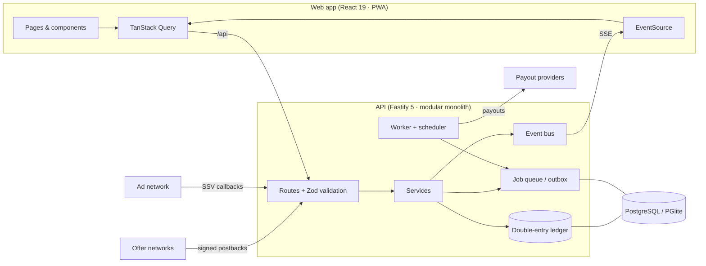

- **`packages/shared`** — Zod request schemas, DTO types, money math, payout-rail catalogue, quality scoring and
  content. One source of truth for both sides.
- **`apps/api`** — Fastify modular monolith: auth & sessions, offers & clicks, postback pipeline with pluggable
  network adapters, rewards, **ledger**, payouts & providers, claims, fraud, engagement, referrals, support,
  transparency, admin and the sandbox world. Postgres-backed job queue (`FOR UPDATE SKIP LOCKED`) as a transactional outbox.
- **`apps/web`** — React 19 + React Router + TanStack Query + Zustand + Tailwind v4. Route-level code splitting, PWA
  manifest + service worker (never caches money data), dark mode, reduced-motion and data-saver modes.

Deep dive: **[docs/architecture.md](docs/architecture.md)** · decisions: **[docs/adr](docs/adr)**.

### Engineering highlights

- **Money can't be wrong silently.** Integer micros; every movement is a balanced double-entry transaction with a
  unique idempotency key; accounts are row-locked in id order; a `CHECK (balance >= 0)` makes overdrafts physically
  impossible; tests assert Σdebits = Σcredits and cached balances = entries after every scenario.
- **Postbacks are idempotent and evidenced.** Every request is logged _before_ processing (signature, IP allowlist,
  replay window); `(network, txn_id)` is unique so retries, replays and claims never double-credit.
- **Exactly-once side effects.** Bonuses, referrals, notifications and stats are enqueued in the same DB transaction
  as the credit (outbox) and processed by retrying workers.
- **Security.** argon2id passwords, opaque revocable sessions (httpOnly, SameSite=Lax), CSRF header check, rate
  limits, RFC 6238 TOTP with replay protection and recovery codes, AES-256-GCM for PII at rest with blind indexes, an
  **encryption-key canary** that refuses to boot with the wrong key, audit log for every staff action, strict CSP in
  production.
- **Verified on real PostgreSQL.** Tests run on PGlite (Postgres 17 in WASM); CI additionally migrates, seeds and
  smoke-tests the production build on PostgreSQL 17.

## Production

```bash
DATA_ENCRYPTION_KEY=$(openssl rand -hex 32) docker compose up --build   # app + Postgres on :4000
```

Configuration is documented in [`.env.example`](.env.example). Going from sandbox to real networks, payout rails, email/SMS
and KYC vendors is covered step by step in **[docs/going-live.md](docs/going-live.md)** — including the live
**Paystack** adapter for Nigerian bank payouts that ships in this repo.

## Documentation

- [Product spec (original research & requirements)](docs/product-spec.md)
- [Spec traceability matrix](docs/spec-traceability.md)
- [Architecture](docs/architecture.md)
- [Going live](docs/going-live.md)
- [Architecture decision records](docs/adr)
