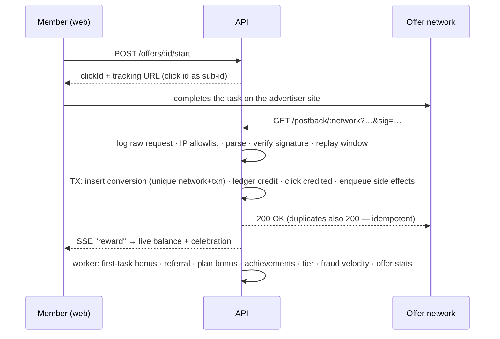
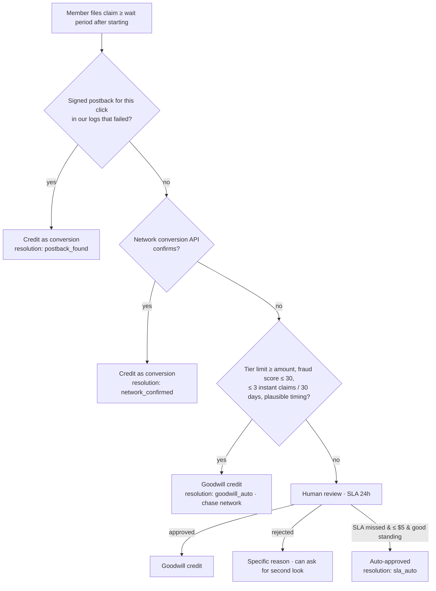
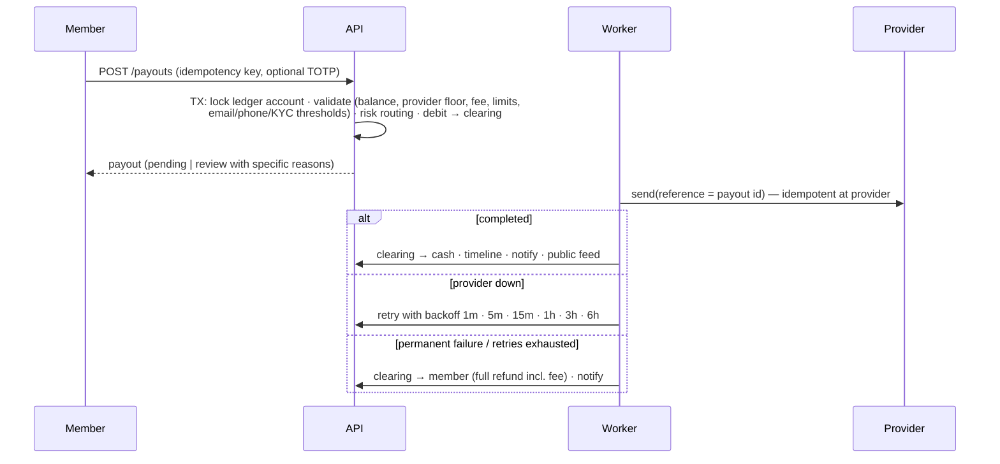

# Architecture

Lucrum is a **modular monolith**: one deployable (Fastify API that also serves the built web app), one PostgreSQL
database, and a Postgres-backed job queue. Each domain lives in its own module with explicit service functions, so
any module can be extracted into a service later without changing callers (see [ADR 0001](adr/0001-modular-monolith.md)).

```
lucrum-offer/
├── packages/shared/          # contracts used by API and web
│   └── src/
│       ├── money.ts          # integer micro-dollar math, fees, formatting
│       ├── catalog.ts        # countries, payout rails, statuses, ban reasons, tiers, achievements
│       ├── schemas.ts        # Zod request schemas + typed platform settings
│       ├── types.ts          # response DTOs
│       ├── quality.ts        # offer quality score (A–F)
│       └── content/          # FAQ, blog, lessons, polls, legal docs
├── apps/api/
│   ├── drizzle/              # SQL migrations (generated from src/db/schema.ts)
│   ├── src/
│   │   ├── app.ts            # Fastify assembly: plugins, CSRF, errors, routes, SPA serving
│   │   ├── server.ts         # boot: migrate → key canary → system data → seed → worker → listen
│   │   ├── db/               # Drizzle schema + client (node-postgres or PGlite)
│   │   ├── http/auth.ts      # sessions, device tracking, guards
│   │   ├── jobs/             # job queue + handlers + scheduler
│   │   ├── modules/          # domain services (see below)
│   │   ├── routes/           # HTTP layer (thin: validate → call service → map)
│   │   └── seed/             # sandbox catalogue + demo data
│   └── test/                 # integration tests (in-memory Postgres per file)
└── apps/web/src/
    ├── routes/{public,auth,app,admin,sandbox}/
    ├── components/           # UI kit, layouts, earning components
    └── lib/                  # API client, queries, realtime (SSE), device id
```

## Domain modules (`apps/api/src/modules`)

| Module              | Responsibility                                                                                                                  |
| ------------------- | ------------------------------------------------------------------------------------------------------------------------------- |
| `wallet/ledger`     | Double-entry ledger: accounts, balanced transactions, idempotency, balance reads, history, invariants                           |
| `auth`              | Registration, login (lockout), MFA (TOTP + recovery codes), email verification, password reset, sessions, phone OTP             |
| `users`             | Profile, preferences, MeDTO, data export, account deletion (PII erasure, ledger retention)                                      |
| `offers`            | Offerwall (geo, filters, hourly rate, quality), clicks, "I finished", activity, ratings, reports, daily plan                    |
| `networks/adapters` | Postback dialects: sandboxnet (HMAC-SHA256 + timestamp), BitLabs (HMAC-SHA1 over URL), md5 walls (status 1/2), Pangle-style SSV |
| `postbacks`         | Log-first pipeline: allowlist → parse → verify → replay window → resolve click → credit/reverse; admin replay                   |
| `rewards`           | Revenue-share credit, reversals (absorb/clawback), goodwill, native sponsor rewards, auto-donation                              |
| `claims`            | Missing Credit ladder, approvals/rejections, SLA sweep with auto-approval                                                       |
| `payouts`           | Methods per country, quotes, destinations (encrypted, masked, name enquiry), requests, processing, retries, refunds             |
| `payouts/providers` | Sandbox rails (latency, outages, failures) and the live Paystack adapter + webhook signature                                    |
| `fraud`             | Explainable signals → score; automatic _pause_ (never automatic ban) at the block threshold                                     |
| `ads`               | Rewarded video: inventory, sessions, event-chain verification, visible-time accounting, earning lock, SSV credit                |
| `native`            | Quick polls ("while you wait") and earn-and-learn lessons                                                                       |
| `engagement`        | Achievements, tiers, streaks (member's local midnight), leaderboard, earning velocity                                           |
| `referrals`         | Attribution, self-dealing detection, two-sided bonus on qualification, residuals                                                |
| `support`           | Tickets with SLAs, appeals (lift/uphold), community feature requests                                                            |
| `finance`           | Charity, tax centre, KYC submissions and uploads                                                                                |
| `transparency`      | Public stats, live payout feed, network reliability, Wall of Shame, status page                                                 |
| `admin`             | Overview, analytics (unit economics + cohorts), members 360°, queues, offers, postbacks, audit, jobs                            |
| `sandbox`           | The simulated outside world: offer network, ad network SSV, identity vendor, dev inbox                                          |

## Money

- All amounts are **integer micro-dollars** (`1 USD = 1,000,000`), stored as `bigint`. Sub-cent rewards (videos pay
  ~$0.008) stay exact; cash-outs are whole cents; display rounds honestly (balances floor, rewards keep 3–4 decimals).
- Every movement is a **balanced double-entry transaction**. Accounts:

| Account                                                            | Normal side | Meaning                                                                            |
| ------------------------------------------------------------------ | ----------- | ---------------------------------------------------------------------------------- |
| `user:{id}:available`                                              | credit      | What we owe the member (CHECK ≥ 0)                                                 |
| `sys:network_receivable:{network}`                                 | debit       | What a network owes us                                                             |
| `sys:platform_revenue`                                             | credit      | Our share                                                                          |
| `sys:bonus_expense` / `sys:goodwill_expense` / `sys:reversal_loss` | debit       | Promotions, "we pay anyway", absorbed chargebacks                                  |
| `sys:payout_clearing`                                              | credit      | Money reserved for in-flight payouts (CHECK ≥ 0 — double completion is impossible) |
| `sys:cash`                                                         | debit       | Settlement (decreases as payouts leave)                                            |
| `sys:charity_payable:{id}`                                         | credit      | Donations awaiting disbursement                                                    |

- Typical postings:

| Event                            | Debit                         | Credit                           |
| -------------------------------- | ----------------------------- | -------------------------------- |
| Conversion ($P, member share $U) | receivable P                  | member U, platform P−U           |
| Reversal (absorb policy)         | platform P−U, reversal_loss U | receivable P                     |
| Goodwill claim                   | goodwill_expense U            | member U                         |
| Late postback after goodwill     | receivable P                  | goodwill_expense U, platform P−U |
| Payout request                   | member A                      | payout_clearing A                |
| Payout completed                 | payout_clearing A             | cash A                           |
| Payout failed / cancelled        | payout_clearing A             | member A                         |

## Key flows

### Offer → postback → credit



### Missing Credit ladder



Members who tap **"I finished"** get active checks with the network at +15 min, 24 h, 48 h and 72 h; if nothing is
confirmed by then, a claim is filed for them automatically.

### Payout



### Rewarded video

The client reports `loaded → started → quartile 1–3 → completed` (plus `hidden/visible/paused/resumed`). The server
timestamps every event itself and verifies order, quartile positions, real elapsed time ≥ duration and **visible**
playtime ≥ duration. Networks with server-side verification (sandbox: Pangle-style `sign = sha256(key:transId)`) then
call `/api/ssv/:network`, which credits idempotently. Only one device can earn at a time (earning lock with explicit
takeover).

## Background jobs

`jobs` table + worker loop (`FOR UPDATE SKIP LOCKED`, exponential backoff, `failed` parking with admin retry) and a
scheduler that enqueues periodic work with per-period dedupe keys (safe with many instances):

| Job                              | Purpose                                                         |
| -------------------------------- | --------------------------------------------------------------- |
| `earning.after`                  | Side effects of any earning (outbox)                            |
| `click.check`                    | Ask the network about a reported click; auto-file claim at 72 h |
| `claim.autoresolve`              | Missing Credit ladder                                           |
| `payout.process` / `payout.poll` | Send / confirm payouts with retries                             |
| `sandbox.*`                      | Simulated network postbacks, SSV callbacks, KYC vendor          |
| `maintenance.minutely`           | Claim SLA sweep, expire clicks and video sessions               |
| `maintenance.hourly`             | Streak reminders (member's local evening), stuck-claim retries  |

## Real-time

`EventBus` (in-process) → Server-Sent Events: `/api/events/stream` (per member: rewards, balance, payouts, claims,
notifications) and `/api/public/feed/stream` (completed payouts). Heartbeats every 25 s keep proxies happy. To scale
horizontally, back the bus with Postgres `LISTEN/NOTIFY` or Redis pub/sub — the interface is unchanged.

## Security model

- **Sessions:** 32-byte random tokens, stored hashed, httpOnly + SameSite=Lax cookies, sliding 30-day expiry,
  device-labelled, revocable (remote sign-out, password reset revokes all).
- **CSRF:** mutations require the `x-requested-with: lucrum` header (cannot be sent cross-site without CORS approval).
- **Passwords:** argon2id (OWASP parameters); constant-time path for unknown accounts; lockout after 8 failures / 15 min.
- **2FA:** RFC 6238 TOTP with ±1 step drift, replay protection and hashed single-use recovery codes; step-up on payouts.
- **PII at rest:** AES-256-GCM (phone, payout details, KYC numbers, TOTP secrets, network secrets) + HMAC blind indexes
  for uniqueness checks; encryption-key canary refuses to boot with the wrong key.
- **Integrations:** constant-time signature comparison, optional IP allowlists, timestamp replay window, raw logs with
  sensitive headers redacted.
- **Abuse controls:** rate limits (global + per-route), explainable fraud scoring, earning lock, poll speed checks,
  lesson retry cooldowns, idempotency keys everywhere money moves.
- **Staff:** role-based access (support / finance / admin), append-only audit log, private uploads served only to staff
  with audited access.

## Scaling path

1. Run several API instances behind a load balancer (sessions and jobs are already in Postgres).
2. Move the event bus to `LISTEN/NOTIFY` / Redis; run workers as a separate process (`WORKER_ENABLED=false` on web nodes).
3. Add read replicas for transparency/analytics queries; materialise the leaderboard and daily metrics.
4. Swap the rate-limit store to Redis.
5. Extract hot modules (postbacks, payouts) into services if traffic demands — the service boundaries already exist.
